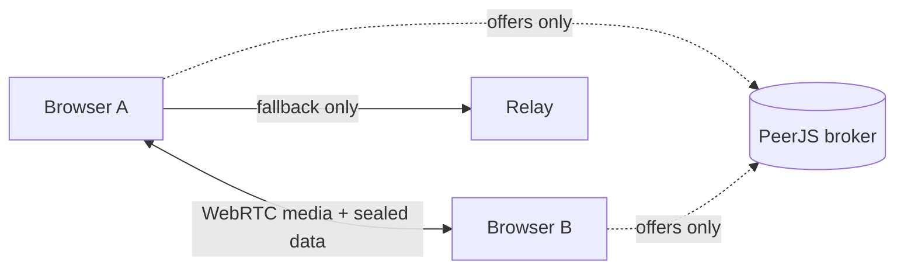

<p align="center"></p>

<h1 align="center">mut3d</h1>
<p align="center"><b>Link-only calls and chat.</b><br>Private video calls and chat for up to 4 people. No account, no phone number, no app, nothing stored.</p>
<p align="center"><a href="https://arbonomous-private-room.pages.dev"><b>Try it</b></a> &middot; <a href="https://arbonomous-private-room.pages.dev/about/">Landing page</a> &middot; <a href="docs/architecture.md">Architecture</a> &middot; <a href="docs/security-and-limits.md">Limits</a></p>

<p align="center">


</p>

> **Status:** a small, working side project by [arbonomous](https://github.com/arbonomous). The cryptography has **not been independently audited**. It is not a replacement for Signal or any audited tool. See [honest limits](#honest-limits).

## What it does
- Start a call, get a link, send it. Guests knock and the host taps **Let in**.
- Group video and voice, chat, and file send (up to 25 MB) in the browser.
- The room key lives after the `#` of the link, so it never reaches a server.
- Nothing about a call is stored. Close the tab and it is gone.
- Extras: invite QR and share sheet, optional short link, room lock and waiting list, voice and face disguise (blur, pixelate, mask, avatar, background blur), light and dark theme, installable on phones.

Details for each feature are in [docs/features.md](docs/features.md).

## How it works

Video and voice go browser to browser over WebRTC. Chat, names and files are also sealed with AES-GCM using the key from the link, and each peer must pass a fresh challenge sealed with that key before anything flows. A small Cloudflare Pages Function hands out relay credentials, takes optional feedback and stores short-link ciphertext. Full write-up: [docs/architecture.md](docs/architecture.md).

## Tech
Vanilla JavaScript bundled with esbuild into one HTML file &middot; WebRTC + PeerJS &middot; Web Crypto (AES-GCM) &middot; MediaPipe Tasks Vision for face and background effects &middot; Cloudflare Pages, Functions and D1 &middot; Playwright tests with real headless browsers.

## Honest limits
- **Not independently audited.** Do not use it where your safety depends on it.
- Anyone with the full link can knock. Share it only over a channel you trust.
- Host approval, lock and end-room are enforced in each person's browser. Modified code could ignore them, and anyone can screenshot or record.
- People in a call can see each other's IP addresses. A small free relay is a fallback and may run out.
- Up to 4 people. Tested in headless browsers, not yet on real phones (share sheet, QR scanning, cutout speed on older iPhones).

The complete list is in [docs/security-and-limits.md](docs/security-and-limits.md).

## Repository layout
```
src/          the app (call.js, call.html, audit.js)
_worker.js    Cloudflare Pages Function: /turn, /fb, /s
public/       manifest, service worker, icons, landing page, model files
brand/        logo set and brand notes
tests/        Playwright tests
docs/         architecture, features, security, testing
parked/       earlier coding and AI version, kept for reference, not built
build.mjs     builds dist/index.html
icons-gen.mjs, fetch-mediapipe.sh, mp.sha256   icon and model-file helpers
```

## Run it
```
npm install
./fetch-mediapipe.sh   # face and background model files (pinned, SHA-256 checked)
npm run build                  # writes dist/index.html
npm test                       # headless browser test suite
```
Deploy `dist/index.html` plus `_worker.js` and `public/` as a Cloudflare Pages project. The app name is one constant, `APP_NAME` in `src/call.js`.

## Feedback
Use **Send feedback** in the app. You see the exact text before it is sent, and it never includes your room link, names or chat.

## Credits
[PeerJS](https://peerjs.com), [MediaPipe](https://ai.google.dev/edge/mediapipe), [qrcode-generator](https://github.com/kazuhikoarase/qrcode-generator), [metered.ca](https://www.metered.ca) (free relay tier), Cloudflare Pages.
