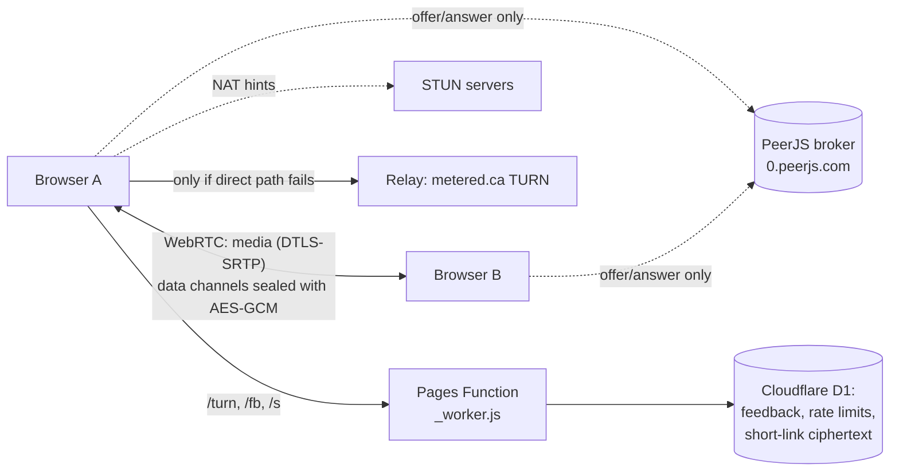

# Architecture

mut3d is a static single-page app plus one small Cloudflare Pages Function. There is no application server, no database of calls and no account system.

## Pieces

| Piece | What it does |
| --- | --- |
| `src/call.js`, `src/call.html`, `src/audit.js` | The whole app. `build.mjs` bundles them with esbuild into one self-contained `dist/index.html`. |
| `_worker.js` | Cloudflare Pages Function (advanced mode). Routes: `/turn` relay credentials, `/fb` feedback, `/s` short links. Everything else is served as static files. |
| `public/` | Manifest, service worker, icons, the landing page (`public/about/`) and the face and background model files (`public/mp/`, fetched by script, not committed). |
| `brand/` | Logo set and brand notes (palette Forest `#131A17`, Signal `#B9F27C`, Chalk `#F5F8F2`). |
| `tests/` | Headless-browser tests (Playwright). See [testing](testing.md). |
| `parked/` | An earlier coding and AI version, kept for reference. Not built, not shown. |

## Call flow

1. The host opens the page and taps Start a call. The browser makes a room id and a random key, and puts the key after the `#` of the link. Browsers never send the part after `#` to any server.
2. Guests open the link. Browsers meet through the public PeerJS broker, which only passes connection offers.
3. Each pair of browsers runs an admission check: a fresh random challenge sealed with the room key. Nothing flows until it is answered correctly. Guests then wait for the host to tap Let in (unless the host turned approval off).
4. Video and voice go browser to browser over WebRTC. Chat, names and files go over data channels and are also sealed with AES-GCM; each message is bound to its type, sender and recipient.
5. If a direct path fails, the browser asks `/turn` for short-lived relay credentials and uses the relay. The relay sees encrypted traffic, IP addresses and timing, not content.

## Where state lives

- Call content: nowhere. Close the tab and it is gone.
- Host controls (approval, lock, waiting list, end room): in the host's browser.
- Short links (optional): AES-GCM ciphertext of the full link, 24 hours, in D1. The decryption code stays after the `#` and never reaches the server.
- Feedback: the note and a few optional device fields, 60 days, in D1.
- Device: the theme name (`dark` or `light`) in local storage, and the app shell in the service worker cache.

## Stack

Vanilla JavaScript, esbuild, WebRTC, PeerJS, Web Crypto (AES-GCM), MediaPipe Tasks Vision (face landmarks, selfie segmentation), `qrcode-generator`, Cloudflare Pages + Functions + D1, Playwright for tests.
